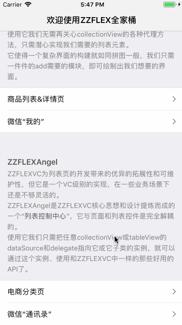
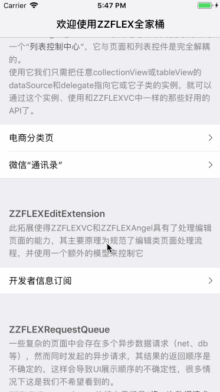
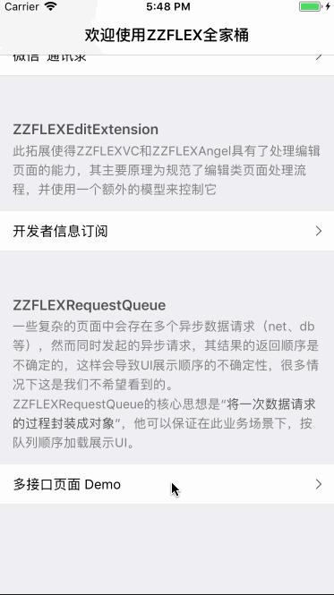
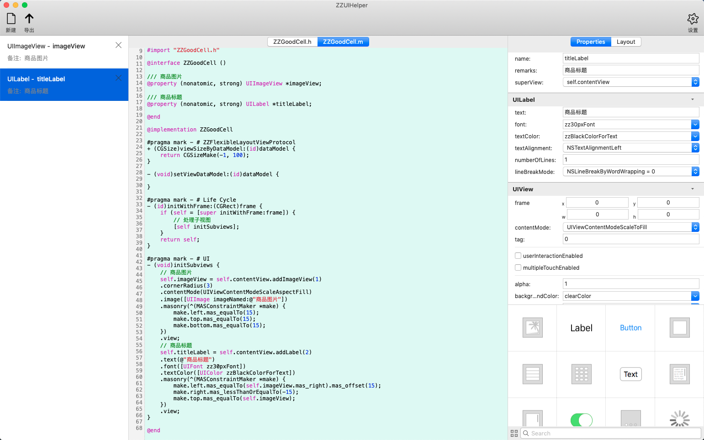

# ZZFLEX

一个完善的iOS UI敏捷开发框架，基于UIKit/Foundation，包含常用控件的链式API拓展、一个命令式的列表控制器、一个事件处理队列，使用“模块化”的设计思路，致力于大大减小UI开发和维护的难度和工作量。

   


  

## 更新

### 1.1 [重大更新，升级攻略](./UpdateTo1.0.md)

1、ZZFLEXCollectionViewController重构，使用ZZFlexAngel核心逻辑；

2、新增ZZFLEXTableViewController，基于UITableView+ZZFLEXAngel实现；

[更多更新记录](./update.md)

## 如何使用

##### 1、直接导入方式

将项目下载到本地后，把ZZFLEX拖入到你的项目中，即可正常使用。

##### 2、CocoaPods方式

```
pod 'ZZFLEX', :git => 'https://github.com/tbl00c/ZZFLEX.git'
```

## 功能模块

目前ZZFLEX主要包含以下6个功能模块：

### 一、Foundation相关拓展

目前有NSMutableAttributedString和NSMutableParagraphStyle的链式API拓展，使用方法如下：

```objective-c
/// 创建style
NSMutableParagraphStyle *style = NSMutableParagraphStyle.zz_create.lineSpacing(5).paragraphSpacing(20).alignment(NSTextAlignmentCenter).lineBreakMode(NSLineBreakByWordWrapping).object;
/// 编辑style
style.zz_setup.headIndent(20).tailIndent(20);

/// 创建富文本
NSMutableAttributedString *attrStr = NSMutableAttributedString.zz_create(@"富文本字符串").backgroundColor([UIColor redColor]).font([UIFont systemFontOfSize:32]).foregroundColor([UIColor redColor]).object;
/// 编辑富文本(拼接图片、字符串、富文本等)
attrStr.zz_setup.paragraphStyle(style).appendString(@"拼接字符串").appendImage([UIImage imageNamed:@"要拼接的图片名称.png"], CGRectMake(0, 0, 20, 20));
/// 设置富文本属性（带range）
attrStr.zz_setup.fontWithRange([UIFont boldSystemFontOfSize:12], NSMakeRange(0, 10)).foregroundColorWithRange([UIColor blueColor], NSMakeRange(0, 10));
```


### 二、UIKit普通控件拓展

#### 2.1 视图控件链式API拓展：

UIView+ZZFLEX为UIKit中的常用控件增加了链式API的拓展，引入它后，我们可以直接为view ```addButton```、 ```addLabel```、 ```addImageView```等。然后通过链式API，可更加连贯快捷的进行控件的属性设置、Masonry布局和事件处理。


以给视图添加button为例说明：

```objective-c
UIButton *button = self.view.addButton(1)
// 设置字体，各状态字色、背景色
.titleFont([UIFont systemFontOfSize:12])
.titleColor([UIColor blackColor]).titleColorHL([UIColor redColor]).titleColorDisabled([UIColor grayColor])
.backgroundColor([UIColor whiteColor]).backgroundColorHL([UIColor yellowColor])
// 设置圆角、阴影
.cornerRadius(5.0f).shadow(CGSizeZero, 5.0f, [UIColor grayColor], 1.0)
// 设置事件
.eventTouchDown(^ (UIButton *sender) {
    NSLog(@"touch down");
})
.eventTouchUpInside(^ (UIButton *sender) {
    NSLog(@"touch inside");
})
// 设置约束（Masonry）
.masonry(^ (UIButton *sender, MASConstraintMaker *make) {
    make.left.top.mas_equalTo(0);
    make.size.mas_equalTo(CGSizeMake(80, 30));
})
.view;
```

可以看出，链式API十分的简洁高效，在大大缩减代码行数的同时、提高了代码的可读性。它使得同一控件的代码逻辑得以集中，我们称之为“控件的模块化”。

UIView+ZZFLEX是使用***Objective-C的泛型***实现的，可以无视继承关系、随意顺序设置控件属性。

如需对控件的属性进行编辑，可以这样写：

```
button.zz_setup.title(@"hello").titleFont([UIFont boldSystemFontOfSize:32]);
```

如需单独创建一个控件，不添加到视图上：

```
UIButton *button = UIButton.zz_create(1001).title(@"hello").titleHL(@"world").view;
```

会发现，在添加视图的时候，ZZFLEX会强制为视图添加一个tag，这样做的初衷是方便定位，此外如果你需要做一些用户行为统计及类似的功能，你或许会更感谢这种做法。

目前，UIView+ZZFLEX已添加链式API的控件有：

```UIView```, ``` UIImageView```, ```UILabel```, ```UIControl```, ```UITextField```, ```UIButton```, ```UISwitch```, ```UIScrollView```, ```UITextView```, ```UITableView```, ```UICollectionView```

#### 2.2 分割线、圆角链式API拓展

```objective-c
/*
 添加分割线
 type：支持top、bottom、left、right、centerX、centerY，同一view可执行多个addSeparatorz操作
 beginAt：开始位置偏移，默认0
 endAt: 结束位置偏移，默认0；也可设置length属性代替
 offset: 具type类型偏移，默认0（-10为距离底端10）
 */
self.view.addSeparator(ZZSeparatorPositionTop).color([UIColor grayColor]).beginAt(15).endAt(-15).offset(-10);
self.view.removeSeparator(ZZSeparatorPositionTop);

/*
 设置圆角
 cornor: 支持topLeft、topRight、bottomLeft、bottomRight、top、bottom、left、right、all，支持逻辑或
 */
self.view.setCornor(ZZCornerPositionLeft | ZZCornerPositionTop).radius(5.0f).color([UIColor grayColor]).borderWidth(1);
self.view.removeCornor();
```


### 三、命令式的列表控制器 · ZZFLEXAngel

ZZFLEXAngel是一个列表页控制器，支持UITableView和UICollectionView，可大幅降低复杂列表界面实现和维护的难度。

#### 3.1 初始化Angel

其初始化原理为**将tableView/collectionView(下统称为hostView)的dataSource和delegate指向angel**，同时angel将弱引用hostView，代码如下：

```objective-c
// tableView
UITableView *tableView = self.view.addTableView(0).view;
ZZFLEXAngel *angel = [[ZZFLEXAngel alloc] initWithHostView:tableView];

// collectionView
UICollectionView *collectionView = self.view.addCollectionView(1).view;
ZZFLEXAngel *angel2 = [[ZZFLEXAngel alloc] initWithHostView:collectionView];
```

#### 3.2 页面容器层（hostView）

使用她，我们通常几乎无需关心和实现hostView的各种代理方法。她的设计使得列表页的构建就如同拼图一般，只需要一件件的add需要的模块，我们想要的界面就绘制出来了，代码如下

```objective-c
- (void)reloadListUI
{
    // 清空所有数据
    self.clear();
    
    // 添加section 1
    {
        // section 标识
        NSInteger sectionType = 1;
        /*
         添加section
         sectionInsets: section边距
         minimumLineSpacing: 行间距
         minimumInteritemSpacing: 列间距
         */
        self.angel.addSection(sectionType).sectionInsets(UIEdgeInsetsMake(15, 15, 15, 15)).minimumLineSpacing(15).minimumInteritemSpacing(15);
        
        /// 设置section header，footer亦然
        self.angel.setHeader([UICollectionReusableView class]).toSection(sectionType);
        
        /*
         往section添加cell
         withDataModel：cell数据模型
         selectedAction：cell点击事件
         eventAction: cell内部事件，业务方自行设置和调用，eventType为事件类型、model是事件数据
         viewTag: cell标识，便于调试，或用于查找定位或作为插入其他cell的锚点
         */
        self.angel.addCell([UICollectionViewCell class]).toSection(sectionType).withDataModel(@"hello")
        .selectedAction(^ (id model) {
            NSLog(@"cell 点击事件");
        })
        .eventAction(^ id(NSInteger eventType, id model) {
            NSLog(@"cell 内部事件，类型：%ld, 模型: %@", eventType, model);
            return nil;
        })
        .viewTag(10001);
        
        /*
         往section批量添加cell
         withDataModelArray：cell数据模型数组，cell个数由数组元素个数决定
         delegate：为cell设置代理
         */
        self.angel.addCells([UICollectionViewCell class]).toSection(sectionType).withDataModelArray(@[@"1", @"2", @"3"])
        .selectedAction(^ (id model) {
            NSLog(@"cell 点击事件，数据模型为：%@", model);
        }).delegate(self);
    }
    
    // 刷新数据
    [self.angel reloadView];
}
```

#### 3.3 元素层

和之前不同的是，所有添加到ZZFLEXAngel中的cell、header、footer需要额外实现一个协议—ZZFlexibleLayoutViewProtocol用于跟Angel交互:

```objective-c
/**
 * 所有要加入ZZFLEXAngel、ZZFLEX*ViewController的view/cell都要实现此协议
 *
 * 除获取大小/高度两个方法需要二选一之外，其余都可按需选择实现
 */

@protocol ZZFlexibleLayoutViewProtocol <NSObject>

@optional;
/**
 * 获取cell/view大小，与viewHeightByDataModel二选一
 * 仅 CollectionView 可选择使用
 *
 * 调用时机：添加到ZZFlexibleLayoutViewController或ZZFLEXAngel时，如实现仅调用一次后，大小会缓存在ViewModel中。
 * 其他：如需更新视图大小，需手动调用update方法
 * 小Tips：0至-1表示比例，如size.width=-0.5时，表示视图的宽度为列表宽度的50%
 */
+ (CGSize)viewSizeByDataModel:(id)dataModel;
/**
 * 获取cell/view高度，与viewSizeByDataModel二选一
 * CollectionView、TableView 均可选择使用
 *
 * 调用时机：添加到ZZFlexibleLayoutViewController或ZZFLEXAngel时，如实现仅调用一次后，高度会缓存在ViewModel中。
 * 其他：如需更新视图高度，需手动调用update方法
 * 小Tips：CollectionView也可用此方法，宽度默认为-1，即列表宽度
 */
+ (CGFloat)viewHeightByDataModel:(id)dataModel;

/**
 * 设置cell/view的数据源
 *
 * 调用时机：cellForRowAtIndexPath或者cellForItemAtIndexPath，如实现每次都会调用
 * 小Tips：如果模型未变化时不需要更新UI，建议在此方法执行时做判断直接return
 */
- (void)setViewDataModel:(id)dataModel;

/**
 * 设置cell/view的delegate对象
 *
 * 调用时机：cellForRowAtIndexPath或者cellForItemAtIndexPath，如实现每次都会调用
 */
- (void)setViewDelegate:(id)delegate;

/**
 * 设置cell/view的actionBlock
 *
 * 调用时机：cellForRowAtIndexPath或者cellForItemAtIndexPath，如实现每次都会调用
 */
- (void)setViewEventAction:(id (^)(NSInteger actionType, id data))eventAction;

/**
 * 当前视图的indexPath，所在section元素数（目前仅cell调用）
 *
 * 调用时机：cellForRowAtIndexPath或者cellForItemAtIndexPath，如实现每次都会调用
 * 小Tips：可用于UI差异化设置等，不建议cell持有indexPath，因为可能会经常变
 */
- (void)onViewPositionUpdatedWithIndexPath:(NSIndexPath *)indexPath sectionItemCount:(NSInteger)count;

@end

```

cell/view实现这个协议的目的和好处有两个：

1、框架层得以统一处理collectionView与cell/header/footer的交互；

2、方便进行整体的性能优化，如缓存view/header/footter计算大小的方法的数据。

#### 3.4 继承ZZFLEXAngel

如果ZZFLEXAngel提供的API尚不足以使用或容器层逻辑较为复杂，可以继承ZZFLEXAngel实现自己的Angel，在子类中可以直接重构/实现hostView的代理方法，如有super记得调用super，否则链式API可能失效。

#### 3.5 其他拓展用法

```objective-c
- (void)reloadListUI
{
    // 清空所有数据
    self.clear();
    
    // 高级用法
    {
        NSInteger sectionType = 2;
        
        self.angel.addSection(sectionType);
        /*
         往section添加cell
         configAction: cell手动配置方法（切面方法，调用时机cellForRowAtIndexPath或者cellForItemAtIndexPath）
         viewSize：直接指定cell大小
         */
        self.angel.addCell([UICollectionViewCell class]).configAction(^ (UICollectionViewCell *cell, id model){
            NSLog(@"自定义配置方法");
            [cell setBackgrounColor:[UIColor redColor]];
        })
        .viewSize(CGSizeMake(100, 100));
    }
    
    // 拓展用法
    {
        // 更改section配置
        self.sectionForTag(1).sectionInsets(UIEdgeInsetsMake(10, 0, 0, 0)).minimumInteritemSpacing(10);
        
        // 插入cell
        self.insertCell([UICollectionViewCell class]).toSection(1).beforeCell(10001);
        self.insertCell([UICollectionViewCell class]).toSection(1).afterCell(10001);
        self.insertCells([UICollectionViewCell class]).toSection(1).toIndex(0).withDataModelArray(@[@"1", @"2"]);
        
        // 删除cell
        self.deleteCell.byViewTag(10001);
        self.deleteCell.byDataModel(@"1");
        
        // 更新cell，通常用于触发cell高度重新计算（默认高度仅计算一次，之后使用缓存）
        self.updateCell.byViewTag(10001);
        
        // section操作，items表示cell+header+footer
        self.sectionForTag(1).clearCells();
        self.sectionForTag(1).clearItems();
        NSMutableArray *data = self.sectionForTag(1).dataModelArray;
      
      	// 获取section信息
      	NSInteget sectionIndex = self.sectionForTag(1).index;
      	NSArray *sectionDataModelArry = self.sectionForTag(sectionType).dataModelArray;
    }
    
    // 刷新数据
    [self.angel reloadView];
}
```

#### 目前主要支持的功能:

|               | 添加 | 插入 | 获取 | 批量添加 | 批量插入 | 批量获取 | 编辑 | 删除 | 清空子数据 | 更新高度 |
| :-----------: | :--: | :--: | :--: | :------: | :------: | :------: | :--: | :--: | :--------: | :------: |
|    section    |  ✔️   |  ✔️   |  ✔️   |          |          |          |  ✔️   |  ✔️   |     ✔️      |    ✔️     |
|     cell      |  ✔️   |  ✔️   |  ✔️   |    ✔️     |    ✔️     |    ✔️     |      |  ✔️   |            |    ✔️     |
| header/footer |  ✔️   |      |  ✔️   |          |          |          |      |  ✔️   |            |    ✔️     |


### 四、ZZFLEXTableViewController和ZZFLEXCollectionViewController

ZZFLEXTableViewViewController基于UITableView和ZZFLEXAngel的VC级实现；

ZZFLEXCollectionViewController基于UICollectionView和ZZFLEXAngel的VC级实现；

直接继承即可，用于快速构建列表页。


可以直接重构tableView代理或collectionView代理中的方法，记得调用super（如存在），否则链式API可能失效。

### 五、ZZFLEXRequestQueue

一些复杂的页面中会存在多个异步数据请求（net、db等），然而同时发起的异步请求，其结果的返回顺序是不确定的，这样会导致UI展示顺序的不确定性，很多情况下这是我们不希望看到的。

ZZFLEXRequestQueue的核心思想是“将一次数据请求的过程封装成对象”，它可以保证在此业务场景下，按队列顺序加载展示UI。

详见Demo。


### 六、ZZFLEXEditExtension（不再建议使用）

此拓展使得ZZFLEXCollectionViewController和ZZFLEXAngel具有了处理编辑页面的能力，其主要原理为规范了编辑类页面处理流程，并使用一个额外的模型来控制它：

初始标准数据模型 -> 经ZZFLEXEditModel封装的数据 -> UI展现 -> 用户编辑 -> 输入合法性判断 -> 标准数据模型 -> 导出数据

  


## ZZUIHelpler 已支持自动生成ZZFLEX代码

 

#### 详见 <https://github.com/tbl00c/ZZUIHelper>


## 其他

使用中的任何问题，欢迎提issure，也可与我交流：libokun@126.com
